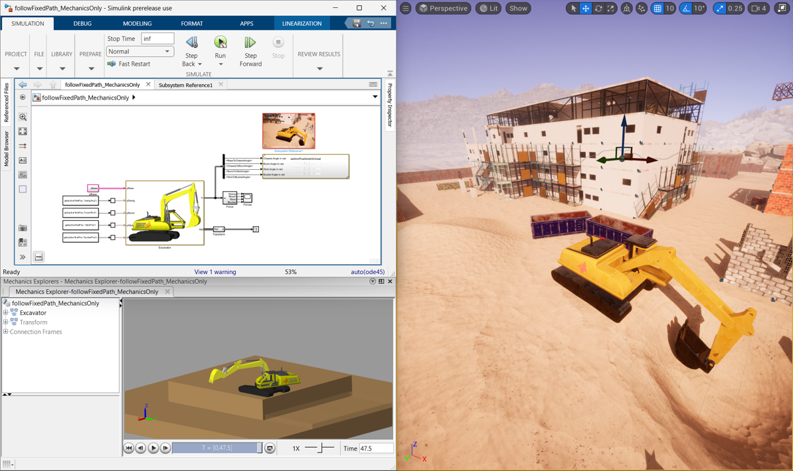
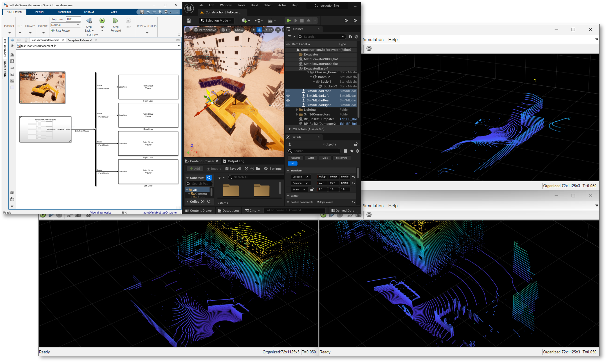
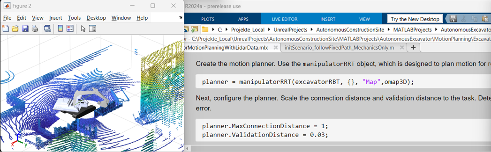

# Autonomous Construction Site 

This repository offers a development environment for an autonomous excavator. 

# Getting Started

The developed application shows how to plan a path for the excavator manipulator arm in MATLAB&reg;, using Lidar data generated in Unreal Engine&reg;. The planned trajectory is then applied to a closed-loop Simulink&reg;/Simscape&trade; model, and visualized in Unreal through co-simulation.

This repo uses LFS and includes a submodule. Downloading the zip of this repo will not work. To download and install this application correctly, you can follow one of the three ways:
1)	In MATLAB, go to Home->New->Project->From Git, and enter: https://github.com/mathworks-robotics/autonomous-excavator.git

2)  In command prompt window, go to the folder where you want to install this application, and enter command: git clone --recurse-submodules https://github.com/mathworks-robotics/autonomous-excavator.git
   
3)	If all above didn't work, You need to first download and install Git (https://git-scm.com/downloads ) and Git LFS (https://git-lfs.com/ ). Then in your command prompt window, go to the folder where you want to install this application, and enter command: git lfs clone --recurse-submodules https://github.com/mathworks-robotics/autonomous-excavator.git

  
Once you have cloned the repo successfully:
1. Open "MATLABProjects\AutonomousExcavator\AutonomousExcavator.prj"
2. Click the MATLAB project shortcut "Closed-Loop Cosimulation"
3. Run the Simulink model, which will run the physical simulation and open the Unreal environment
4. You may encounter the error message that "Could not find AutonomousExecavator.exe" at the given path." This is asking you to input the correct path to the Unreal excecutable. The AutonomousExecavator.exe is always in your project folder\Unreal\Build\Windows\AutonomousExcavator.exe. Double click open the Simulink 3D Scene Configuration block, and change the project path to the correct path. 

# Demo Highlights

There are various aspects to the demo which can be highlighted.

## Generate Lidar Data with Unreal Engine

The excavator is equipped with 4 lidar sensors (front, rear, left, right). The MATLAB project shortcut "Lidar Sensor Test" opens a script that shows how sensor data can be captured in MATLAB from Unreal through cosimulation.

## Motion Planning

The lidar data from above can be used to create a 3D occupancy map, which can be used to plan a collision-free path for the excavator manipulator arm. The MATLAB project shortcut "Motion Planning" opens a script that guides the user through the workflow.

## Solidworks Export Workflows

The CAD model of the excavator is used as the single source of truth for the Simscape model, for the 3d model in Unreal, and for the rigid body tree model for motion planning. This ensures consistency in the physical dimensions and visuals across all parts of the workflow.

The Simscape Multibody Link is used to export the CAD model to Simscape. 

A [third-party URDF exporter](https://github.com/ros/solidworks_urdf_exporter/releases) is used to export the rigid body tree model. 

The [Datasmith plugin](https://www.unrealengine.com/en-US/datasmith/plugins) is used to export from Solidworks to Unreal Engine.

# Requirements
- Windows OS
- MATLAB 2024a

Toolboxes: 
- Simulink
- Robotics System Toolbox
- Navigation Toolbox
- Image Processing Toolbox
- Computer Vision Toolbox
- Simscape Multibody

